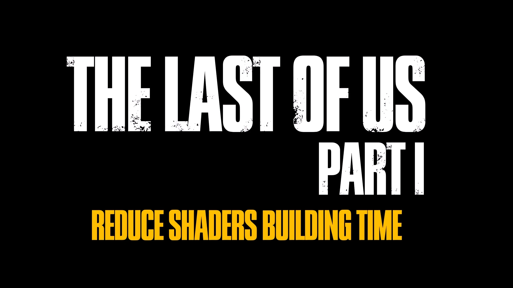

  

<h1 align="center">Reduce shaders building time</h1>

  <strong>Optimization mod for The Last of Us Part I</strong>

  Moves shaders pre-compilation from the main menu to the loading screen, while significantly speeding up the process. Instead of pre-compiling everything all at once, only the necessary shaders for the act that is being loaded will be compiled.

---

## 📥 Downloads

> **[NOTICE]**  
> Source code is not uploaded to this repository, it only offers compiled releases as an alternative to NexusMods.

The mod can be downloaded from either of the following platforms:
* **[GitHub Releases](https://github.com/ShyVortex/tlou-reduce-shadcomp/releases)**
* **[NexusMods](https://www.nexusmods.com/thelastofuspart1/mods/70)**

---

## ⚠️ Compatibility

> **[IMPORTANT]**  
> * This mod **only** works with the **Steam** version of the game.
> * Epic Games version makes the game fail to launch. **DO NOT INSTALL.**
> * Since version **1.8.0**, Windows 10 support has been marked as deprecated. Users of Windows 10 should stick to previous versions (**1.7.1 or below**).
> * Official Linux support is currently in beta, added since version **1.9.0b2**.

---

## 🛠️ Current Branch

| Status | Version | Release |
| :----- | :------ | :------- |
| 🟢 Stable | 1.9.0 | [Download](https://github.com/ShyVortex/tlou-reduce-shadcomp/releases/tag/v1.9.0) |

## How It Works

Upon reaching the main menu after resetting the PSO cache, you'll notice there isn't any shaders building popup.

* **First Act Load:** when you load into a chapter for the first time, you'll be greeted with a longer loading screen (from 2 to 8-9 minutes), which ensures all the shaders for the selected act (collection of chapters that includes the one you're playing) will be compiled.
* **Subsequent Level Loads:** when you load a different chapter in the same act, the loading screen will still be slightly longer than usual (1-3 minutes) to load the remaining shaders. If you load a completely different act, it will revert to the same initial longer loading. This only applies for the first time.
* **Background Compiling:** extra work can be done asynchronously while playing to avoid issues when progressing through the game.
* **Re-loading Chapters:** when you load the same chapters a second time, the game will load in normally as all shaders for those chapters are already compiled.

### Technical details
The mod works by:
* Improving the DirectX 12 pipeline implementation.
* Using a custom Oodle DLL file.
* Adding DirectStorage support.
* Faking the PSO manifest to trigger per-level shaders building.

---

## Installation

1. Drag and drop all files from the release archive into the game's main folder.
2. A `backup` folder is included in this repository from TLOU's latest PC patch (1.1.5.0) in case something doesn't work correctly and you need to restore them.

---

## Support

If you like this mod and wish to support my work, you may consider buying me a coffee on [**Ko-fi**](https://ko-fi.com/shyvortex).

---

## Credits

Special thanks to the following testers for helping test the 1.5 branch:

* **@BigzadKZ** on Nexus
* **@whyyylmao** on Twitter
* **@kimi_sha19** on Twitter
* **@Lakshay51367304** on Twitter
* **@mpr_reviews** on Twitter

Thank you!

## License
- This project is distributed under the [CC-BY-NC-ND 4.0 License](https://github.com/ShyVortex/tlou-reduce-shadcomp/blob/main/LICENSE.md).
- © Copyright of [@ShyVortex](https://github.com/ShyVortex), 2026.
